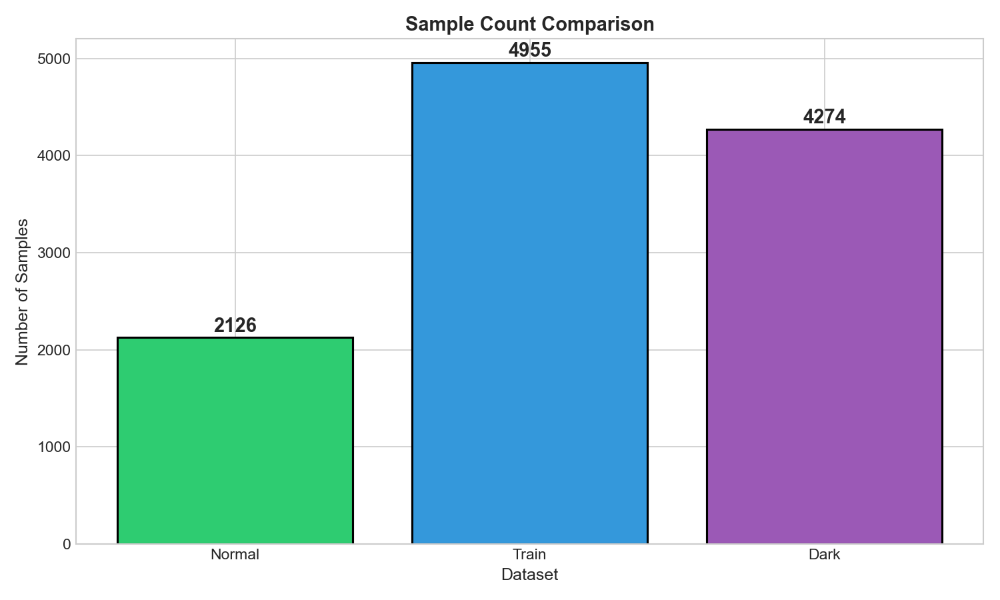
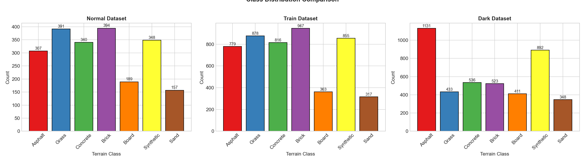
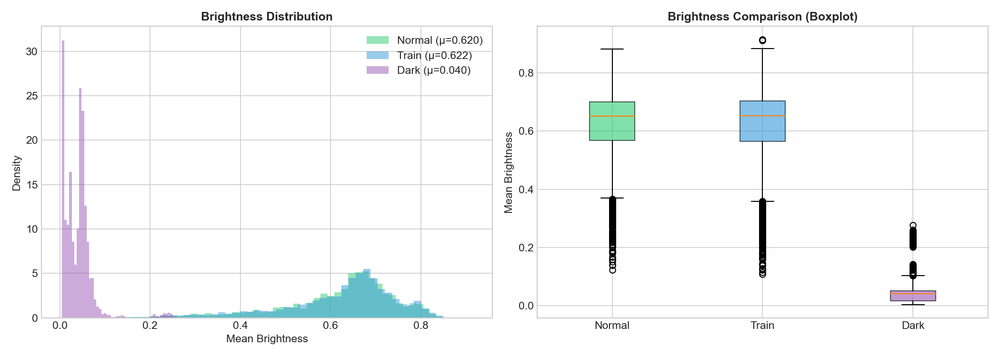
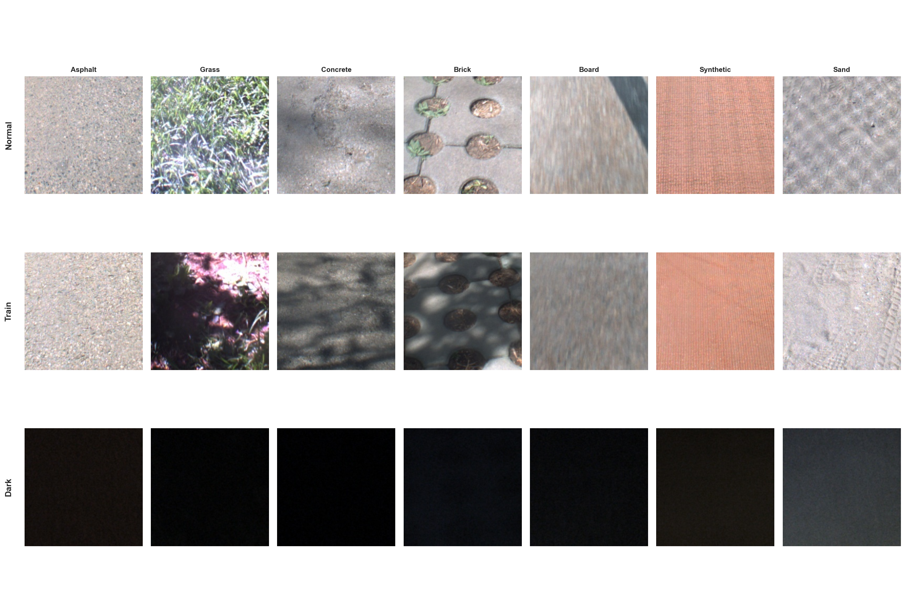
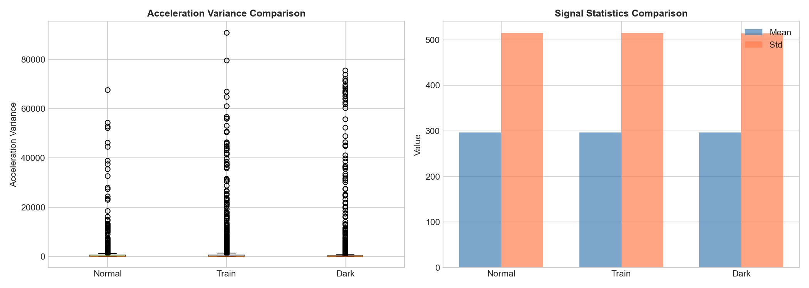

# VP-Terrain 多数据集对比分析报告

---

## 1. 数据集概览

VP-Terrain数据集包含多个子集：

| 数据集 | 采集条件 | 用途 | 说明 |
|--------|----------|------|------|
| Train | 白天正常光照 | 训练 | 用于模型训练 |
| Normal | 白天正常光照 | 测试 | 正常条件测试 |
| Dark | 夜晚低光照 | 测试 | 暗光条件测试（OOD场景） |

---

## 2. 样本数量对比

| 数据集 | 样本数量 |
|--------|----------|
| Normal | 2126 |
| Train | 4955 |
| Dark | 4274 |

---

## 3. 类别分布对比

### 各数据集类别统计

| 类别 | Normal | Train | Dark |
|------|------|------|------|
| Asphalt | 307 | 779 | 1131 |
| Grass | 391 | 878 | 433 |
| Concrete | 340 | 816 | 536 |
| Brick | 394 | 947 | 523 |
| Board | 189 | 363 | 411 |
| Synthetic | 348 | 855 | 892 |
| Sand | 157 | 317 | 348 |

---

## 4. 亮度对比分析

### 亮度统计

| 数据集 | 平均亮度 | 亮度标准差 |
|--------|----------|------------|
| Normal | 0.6204 | 0.1260 |
| Train | 0.6219 | 0.1289 |
| Dark | 0.0404 | 0.0346 |

**关键发现**:
- **Dark数据集** 的平均亮度明显低于Normal和Train数据集
- 这符合PDF中描述的"暗光集采集自夜晚低光照条件"
- Dark数据集可用于测试模型在**光照变化**（OOD场景）下的鲁棒性

---

## 5. 样本图像对比

**观察**:
- Normal/Train数据集图像亮度正常，纹理清晰
- Dark数据集图像整体偏暗，可能影响视觉特征提取
- 这验证了多模态融合（视觉+机体感知）的必要性

---

## 6. 信号特征对比

**分析**:
- 机体感知信号（IMU）**不受光照条件影响**
- 这是PDF中强调的机体感知的优势："稳定性强，不受光照、天气等影响"
- 在Dark条件下，机体感知信号可以弥补视觉感知的不足

---

## 7. 总结

| 数据集 | 特点 | 建议用途 |
|--------|------|----------|
| Train | 样本充足，光照正常 | 模型训练 |
| Normal | 光照正常 | 标准测试 |
| Dark | 低光照，视觉特征弱 | OOD鲁棒性测试 |

---

