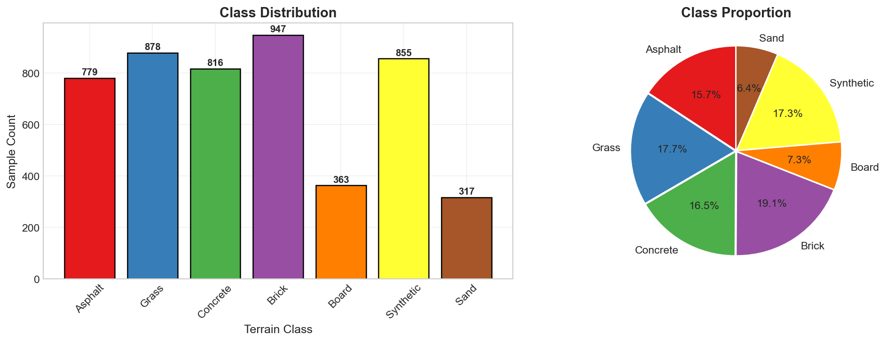
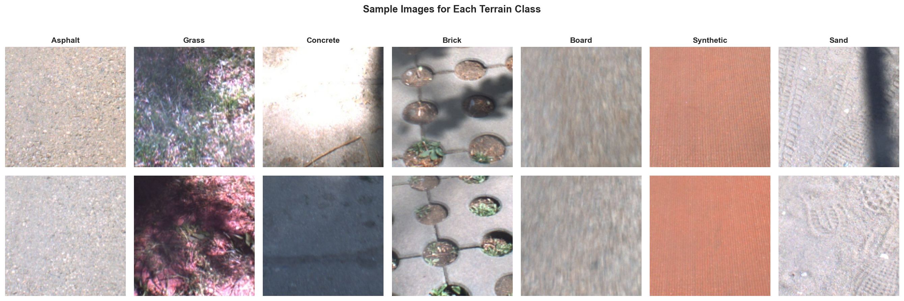
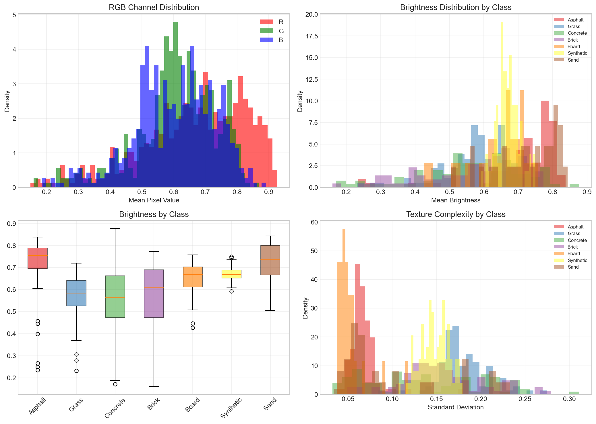
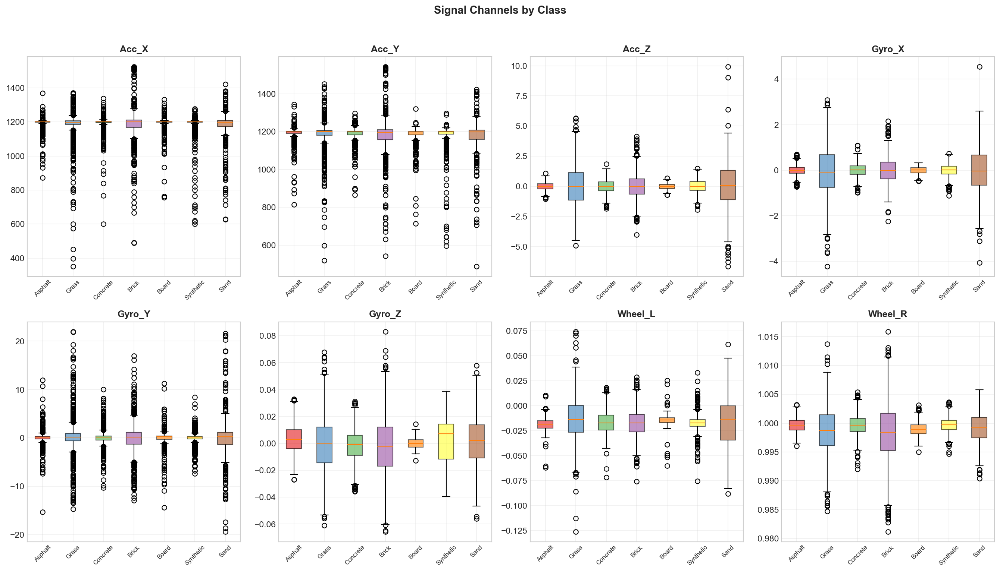
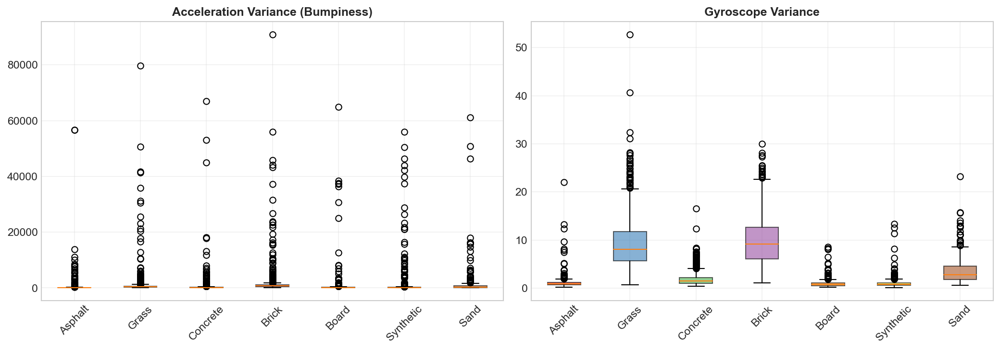
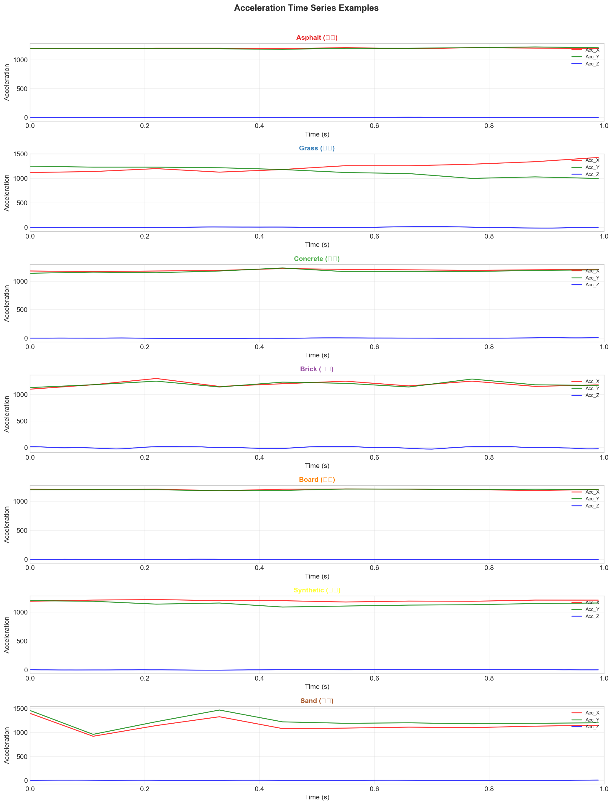
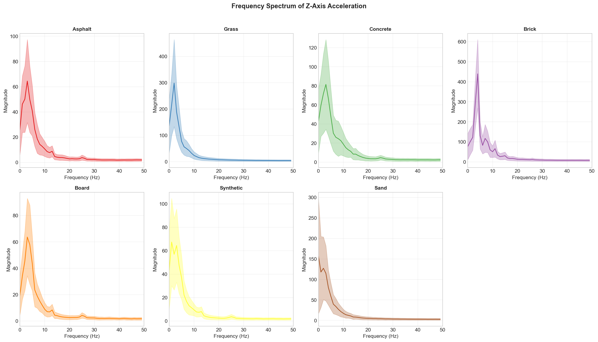
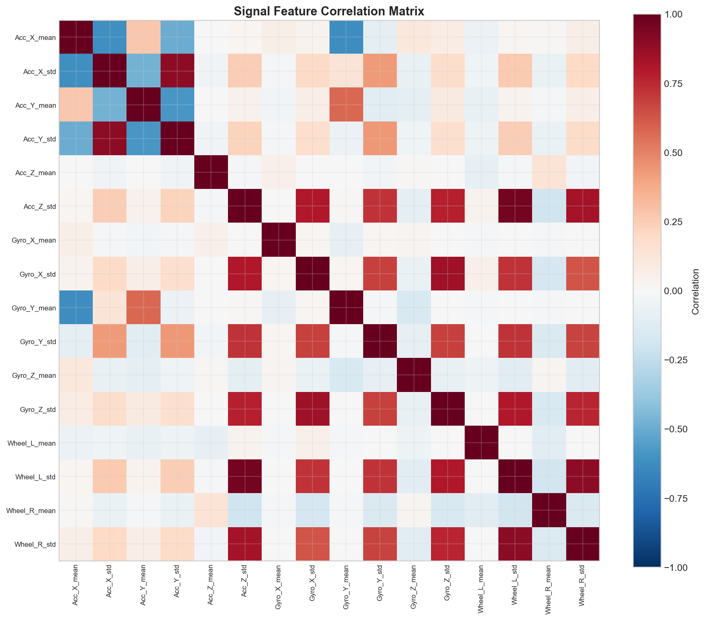
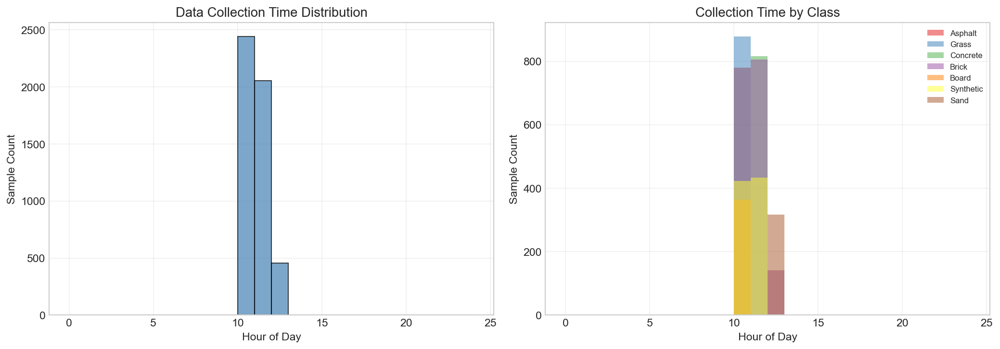

# VP-Terrain 数据集分析报告

> **数据文件**: `_train_7_new.hdf5`

---

## 目录

1. [数据集概述](#1-数据集概述)
2. [数据结构分析](#2-数据结构分析)
3. [类别分布统计](#3-类别分布统计)
4. [视觉数据分析](#4-视觉数据分析)
5. [机体感知数据分析](#5-机体感知数据分析)
6. [时序信号分析](#6-时序信号分析)
7. [频域分析](#7-频域分析)
8. [特征相关性分析](#8-特征相关性分析)
9. [数据采集时间分析](#9-数据采集时间分析)
10. [总结](#10-总结)

---


## 1. 数据集概述

VP-Terrain 是一个用于**地表属性分类**的多模态数据集，包含视觉图像和机体感知信号两种模态的数据。

### 1.1 数据集背景

根据相关研究文献，该数据集：
- **采集平台**: 基于 Autolabor Pro 1 移动机器人
- **传感器配置**: 
  - Point Grey Flea 2 单目摄像头（视觉感知）
  - XW-GI5651 6DOF IMU（惯性测量单元）
  - 轮速编码器
- **采集地点**: 北京大学校园内不同地表环境区域
- **采集条件**: 包括中午阳光充足时段和傍晚光线不足时段

### 1.2 数据集规模

| 指标 | 数值 |
|------|------|
| 总样本数 | **4955** |
| 地形类别数 | **7** |
| 图像尺寸 | **224 × 224 × 3** (RGB) |
| 信号长度 | **100 时间步 × 8 通道** (1秒@100Hz) |

### 1.3 地形类别

| 类别ID | 中文名称 | 英文名称 |
|--------|----------|----------|
| 0 | 沥青 | Asphalt |
| 1 | 草地 | Grass |
| 2 | 水泥 | Concrete |
| 3 | 砖路 | Brick |
| 4 | 地板 | Board |
| 5 | 塑胶 | Synthetic |
| 6 | 沙地 | Sand |

---


## 2. 数据结构分析

### 2.1 HDF5 文件结构

```
_train_7_new.hdf5
├── images/
│   └── images      # 视觉图像数据
├── labels/
│   └── labels      # 地形类别标签
├── signals/
│   └── signals     # 机体感知信号
└── timeStamps/
    └── timeStamps  # 数据采集时间戳
```

### 2.2 各数据集详细信息

#### 视觉数据 (images/images)

| 属性 | 值 |
|------|-----|
| 原始形状 | `(4955, 150528)` |
| 还原形状 | `(4955, 224, 224, 3)` |
| 数据类型 | `float32` |
| 像素值范围 | [9.0, 255.0] |
| 像素均值 | 158.69 |
| 像素标准差 | 48.73 |

**说明**: 原始数据为展平的一维向量 (150528 = 224×224×3)，需要 reshape 为 (N, 224, 224, 3) 的 RGB 图像格式。

#### 标签数据 (labels/labels)

| 属性 | 值 |
|------|-----|
| 形状 | `(4955,)` |
| 数据类型 | `int64` |
| 类别范围 | [0, 6] |
| 类别数量 | 7 |

#### 信号数据 (signals/signals)

| 属性 | 值 |
|------|-----|
| 原始形状 | `(4955, 800)` |
| 还原形状 | `(4955, 100, 8)` |
| 数据类型 | `float32` |
| 数值范围 | [-45.60, 1648.33] |
| 均值 | 296.53 |
| 标准差 | 514.89 |

**说明**: 原始数据为 800 维向量 (800 = 100时间步 × 8通道)，需要 reshape 为 (N, 100, 8)。

**8个信号通道**:
1. `Acc_X` - X轴加速度
2. `Acc_Y` - Y轴加速度  
3. `Acc_Z` - Z轴加速度
4. `Gyro_X` - X轴角速度
5. `Gyro_Y` - Y轴角速度
6. `Gyro_Z` - Z轴角速度
7. `Wheel_L` - 左轮角速度
8. `Wheel_R` - 右轮角速度

#### 时间戳数据 (timeStamps/timeStamps)

| 属性 | 值 |
|------|-----|
| 形状 | `(4955,)` |
| 数据类型 | `int64` |
| 起始时间 | 2024-03-29 10:22:50 |
| 结束时间 | 2024-04-19 10:52:19 |
| 采集跨度 | 21 天 |

---


## 3. 类别分布统计

### 3.1 类别分布图



### 3.2 详细统计表

| 类别ID | 类别名称 | 样本数量 | 占比 |
|--------|----------|----------|------|
| 0 | Asphalt (沥青) | 779 | 15.72% |
| 1 | Grass (草地) | 878 | 17.72% |
| 2 | Concrete (水泥) | 816 | 16.47% |
| 3 | Brick (砖路) | 947 | 19.11% |
| 4 | Board (地板) | 363 | 7.33% |
| 5 | Synthetic (塑胶) | 855 | 17.26% |
| 6 | Sand (沙地) | 317 | 6.40% |

| **合计** | - | **4955** | **100%** |

### 3.3 类别平衡性分析

| 指标 | 值 | 说明 |
|------|-----|------|
| 最多样本类别 | Brick (947) | 样本最充足的类别 |
| 最少样本类别 | Sand (317) | 样本最稀缺的类别 |
| 不平衡比率 | **2.99** | 最大/最小样本数比值 |

**解读**:
- 不平衡比率 2.99 表示样本最多的类别是样本最少类别的 2.99 倍
- 一般认为比率 > 3 为中度不平衡，> 10 为严重不平衡
- 当前数据集属于**轻度不平衡**

---


## 4. 视觉数据分析

### 4.1 样本图像展示



**说明**: 展示了每个地形类别的随机样本图像（每类2张），可以直观感受不同地形的视觉特征差异。

### 4.2 图像统计特征



### 4.3 RGB 通道统计

| 通道 | 均值 | 标准差 |
|------|------|--------|
| R (红) | 0.6644 | 0.2133 |
| G (绿) | 0.6066 | 0.1793 |
| B (蓝) | 0.6001 | 0.1804 |

**图表解读**:

1. **RGB通道分布图** (左上)
   - 显示三个颜色通道的像素值分布
   - 可用于判断是否存在颜色偏移或需要颜色标准化

2. **亮度分布图** (右上)
   - 亮度计算公式: \(L = 0.299R + 0.587G + 0.114B\)
   - 不同类别的亮度分布有一定差异，可作为分类特征

3. **亮度箱线图** (左下)
   - 直观展示各类别亮度的中位数、四分位数和异常值
   - 便于比较类间差异

4. **纹理复杂度** (右下)
   - 使用图像标准差衡量纹理复杂程度
   - 标准差越大，表示图像细节越丰富

### 4.4 各类别亮度统计

| 类别 | 亮度均值 | 亮度标准差 |
|------|----------|------------|
| Asphalt | 0.7180 | 0.1175 |
| Grass | 0.5667 | 0.0939 |
| Concrete | 0.5600 | 0.1515 |
| Brick | 0.5691 | 0.1450 |
| Board | 0.6415 | 0.0839 |
| Synthetic | 0.6694 | 0.0308 |
| Sand | 0.7250 | 0.0873 |


---


## 5. 机体感知数据分析

### 5.1 信号通道说明

机体感知数据包含 8 个通道，采样率为 100Hz，每个样本记录 1 秒数据（100个时间步）：

| 通道序号 | 通道名称 | 物理含义 | 单位 |
|----------|----------|----------|------|
| 0 | Acc_X | X轴线性加速度 | m/s² |
| 1 | Acc_Y | Y轴线性加速度 | m/s² |
| 2 | Acc_Z | Z轴线性加速度 | m/s² |
| 3 | Gyro_X | X轴角速度 | rad/s |
| 4 | Gyro_Y | Y轴角速度 | rad/s |
| 5 | Gyro_Z | Z轴角速度 | rad/s |
| 6 | Wheel_L | 左轮角速度 | rad/s |
| 7 | Wheel_R | 右轮角速度 | rad/s |

### 5.2 各通道统计量

| 通道 | 均值 | 标准差 | 最小值 | 最大值 |
|------|------|--------|--------|--------|
| Acc_X | 1187.6031 | 81.7352 | -29.9589 | 1599.1687 |
| Acc_Y | 1183.5730 | 79.4083 | 129.9401 | 1648.3254 |
| Acc_Z | -0.0079 | 5.5867 | -45.5977 | 31.5549 |
| Gyro_X | -0.0085 | 3.0452 | -23.3462 | 32.8091 |
| Gyro_Y | 0.0658 | 3.5461 | -24.3425 | 30.3023 |
| Gyro_Z | 0.0004 | 0.0548 | -0.4370 | 0.3958 |
| Wheel_L | -0.0165 | 0.0685 | -0.4577 | 0.3820 |
| Wheel_R | 0.9991 | 0.0757 | 0.5011 | 1.9020 |


### 5.3 信号分布箱线图（按类别）



**图表解读**:
- 每个子图展示一个信号通道在不同地形类别下的分布
- 箱线图显示中位数（箱内横线）、四分位距（箱体）和异常值（圆点）
- **类间差异越大**，该通道对分类的贡献越大

### 5.4 信号方差对比（颠簸程度指标）



**图表解读**:

1. **加速度方差** (左图)
   - 反映地形的**颠簸程度**
   - 方差越大，地形越不平整
   - 预期：草地、沙地方差较大；塑胶、沥青方差较小

2. **角速度方差** (右图)
   - 反映机器人的**旋转稳定性**
   - 方差越大，行驶越不稳定


---


## 6. 时序信号分析

### 6.1 各类别加速度时序示例



**图表解读**:
- 每个子图展示一个地形类别的加速度信号随时间变化
- 红色: X轴加速度，绿色: Y轴加速度，蓝色: Z轴加速度
- 信号的**振幅**和**波动频率**反映地形特征

**观察要点**:
1. **沥青/塑胶**: 信号相对平稳，振幅小
2. **草地/沙地**: 信号波动大，高频成分多
3. **砖路**: 可能存在周期性振动（砖块间隙）
4. **Z轴加速度**: 通常最能反映地形颠簸程度

---


## 7. 频域分析

### 7.1 Z轴加速度频谱



**图表解读**:
- 使用**快速傅里叶变换 (FFT)** 将时域信号转换为频域
- 横轴为频率 (Hz)，纵轴为幅度
- 阴影区域表示 ±1 标准差范围

**频谱特征含义**:

| 频率范围 | 物理含义 |
|----------|----------|
| 0-5 Hz | 低频成分，与整体运动趋势相关 |
| 5-20 Hz | 中频成分，与地形主要振动相关 |
| 20-50 Hz | 高频成分，与细微颠簸和噪声相关 |


---


## 8. 特征相关性分析

### 8.1 信号特征相关性矩阵



**图表解读**:
- 矩阵展示了 16 个信号特征（8通道 × 2统计量）之间的相关系数
- **红色**: 正相关 (接近 +1)
- **蓝色**: 负相关 (接近 -1)
- **白色**: 无相关 (接近 0)

---


## 9. 数据采集时间分析

### 9.1 采集时间分布



### 9.2 采集时段统计

| 时段 | 样本数 | 占比 |
|------|--------|------|
| 白天 (6:00-18:00) | 4955 | 100.0% |
| 夜晚 (18:00-6:00) | 0 | 0.0% |


---


## 10. 总结


| 方面 | 特点 |
|------|------|
| **数据规模** | 4955 个样本，7 类地形 |
| **多模态** | 视觉 (224×224 RGB) + 机体感知 (8通道@100Hz) |
| **时间跨度** | 数据采集跨越多个日期 |


---

## 附录

### A. 文件说明

| 文件 | 说明 |
|------|------|
| `_figures/1_class_distribution.png` | 类别分布图 |
| `_figures/2_sample_images.png` | 样本图像展示 |
| `_figures/3_image_statistics.png` | 图像统计特征 |
| `_figures/4_signal_boxplot.png` | 信号箱线图 |
| `_figures/5_signal_variance.png` | 信号方差对比 |
| `_figures/6_time_series.png` | 时序信号示例 |
| `_figures/7_frequency_analysis.png` | 频域分析 |
| `_figures/8_correlation.png` | 特征相关性 |
| `_figures/9_timestamp.png` | 时间戳分析 |

### B. 参考文献

1. TerraX: Visual Terrain Classification Enhanced by Vision-Language Models (IROS 2025)
2. VINet: Visual and Inertial-based Terrain Classification (ICRA 2023)
3. Proprioception Is All You Need: Terrain Classification for Boreal Forests (IROS 2024)

---

